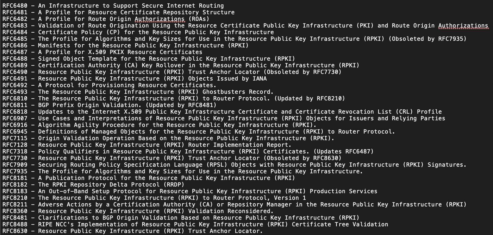
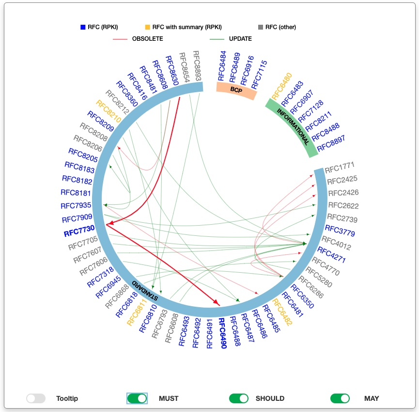

# RPKI RFCs Graph
Resource Public Key Infrastructure (RPKI) is the ways to cryptographically sign records that associate a Border Gateway Protocol (BGP) route announcement with the correct originating AS number. But if you are just getting started about RPKI or simply wish to read up on it, you will soon realize there is not one single authoritative Request for Comment (RFC)on the topic. In fact, there are more than 40 RFCs about RPKI found in different categories. 

## Goals i.e. Which RPKI-related RFCs should you read ?
What RFC should you read first? What can you learn from the various RFCs? Should you read all of them? To help you find useful information efficiently, we try to answer all these questions with a new tool: the RPKI RFCs Graph. This graph shows the dynamics of all the RPKI-related RFCs and gives you a brief of each. The RFCs are represented in an interactive graph where you can see their relationsto each other.


## Scripts
### python requirements
* `json`: read/format/save json object.
* `markdown_tree_parser`: parse markdown file to python object, which contains markdown tree headings.
* `marko`: parse markdown tree headings.

### Folders and files
```
.
├── data
│   ├── rfc-index.txt
│   ├── rfcs_groups.json
│   └── rfcs_summaries.json
├── html
│   ├── css
│   │   ├── bootstrap.min.css
│   │   ├── style.css
│   │   └── titatoggle-dist-min.css
│   ├── data
│   │   └── rfcs_data.json
│   ├── figure
│   │   ├── rfc6482_roa_template.jpg
│   │   └── rfc6482_roa_template.pdf
│   ├── index.html
│   └── js
│       ├── bootstrap.min.js
│       ├── d3.v3.min.js
│       ├── data-format.js
│       └── jquery-1.12.3.min.js
├── rpki_rfcs_graph.jpg
├── rpki_rfcs_list.txt
├── src
│   ├── graphData.py
│   ├── groups.py
│   └── summaries.py
└── summaries
    ├── rfc6482_summary.md
    └── template.md
```
* `./data/`: automatically generated files containing graph data.
    * `rfc-index.txt` is the local copy of [RFC index](https://www.rfc-editor.org/rfc/rfc-index.txt).
    * `rfcs_groups.json`: RFCs groups MUST, MAY and SHOULD members.
    * `rfcs_summaries.json`: Generated and formated RFCs brief.
* `./html/`: html related files to draw the graph. This folder should be used as root on your web server to see the graph.
    * `data/rfcs_data.json`: main data source use by the javascripts in the index file to draw graph.
    * `figure`: contains images, pictures used in summaries. 
* `rpki_rfcs_list.txt`: RPKI RFCs list as provided by [Aftab](https://twitter.com/aftabsiddiqui/status/1296103956242825216)
* `src`: python scripts:
    * `graphData.py`: main script to generate graph data.
    * `groups.py`: create RFCs groups saved in file `./data/rfcs_groups.json`
    * `summaries.py`: python class to format RFCs briefs. This script rely on briefs in Markdown format in folder `./summaries/`. 
* `./summaries`: RFCs brief in a Markdown format. Please note that the brief file naming convention is as follows: `rfcID_summary.md` where `ID` is the RFC number.

## How to
### Add/update briefs
Create new  or update RFC brief and save it in folder `./summaries` with the name `rfcID_summary.md` where `ID` is the RFC number. A call to the main python script `src/graphData.py` will update the briefs database. Please note that images or pictures path should be relative to `./html/figure` folder.
### Change category for an RFC
For now, just update file `./data/rfcs_groups.json`
### Create graph
```
$ python3 src/graphData.py -r rpki_rfcs_list.txt
#####= Getting RPKI RFCs list =#####
#####= Downloading RFCs Index file =#####
#####= Creatin RPKI RFCs briefs =#####
#####= Getting RPKI RFCs groups =#####
#####= Formating RFCs data =#####
#####= RPKI RFCs Graph saved in file ./html/data/rfcs_data.json =#####
```

### See graph
Update your web server root path and reload configuration. For instance, we have following for Nginx
```
root /path/to/rpki-rfcs-graph/html;
```


## Team
This work has been done as part of MANRS fellow research group activity. The team was composed of (alphabetical order):

* Alfred Arouna (fellow)
* Aftab Siddiqui (program manager)
* Augusto Mathurin (fellow)
* Bahaa Al-Musawi (fellow)
* Boris Mimeur (Ambassador)

## Credits
RFCs metadata (tooltip in the graph) is adpapted from AndreaOlivieri'[rfc2json](https://github.com/AndreaOlivieri/rfc2json.git)

RFCs graph organisation into group is inspired by the [Hierarchical edge bundling with dynamically generated arcs for each group](http://bl.ocks.org/slattery/52970ba87b5ad6f914804a19df639e3a)

## Licence ##
MIT License

Copyright (c) 2021 Alfred Arouna

